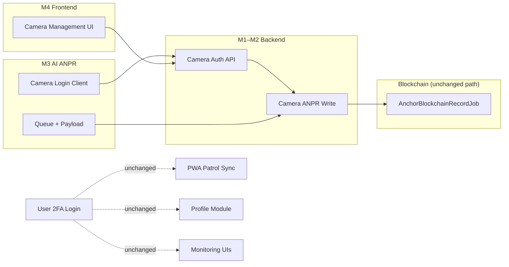

# M0 — Planning, Audit, and Compatibility Freeze

> Historical milestone snapshot (2026-06-30).
> This section describes the codebase at that milestone and is retained for traceability.
> For current runtime behavior, see [`m3-ai-anpr-credential-migration.md`](./m3-ai-anpr-credential-migration.md) and [`system-update-roadmap.md`](../system-update-roadmap.md).

**Milestone:** M0  
**Status:** Complete (documentation only)  
**Date:** 2026-06-30  
**Source of truth:** [`system-update-roadmap.md`](../../system-update-roadmap.md)

---

## 1. Executive Summary

M0 establishes an implementation baseline before any production code changes for the System Update (camera credential auth, UI/UX standardization, PWA tuning, patrol validation tuning, and dashboard redesign). This milestone produced architecture audits, compatibility reviews, API contract drafts, a role access matrix, breaking-change assessment, and a frozen test baseline.

**Non-negotiable constraint preserved:** User login with mandatory 2FA remains unchanged. Camera machine identities must be separate from user authentication.

**M0 scope confirmation:**

| Constraint | Status |
|------------|--------|
| No production code behavior changed | Confirmed |
| No API behavior changed | Confirmed |
| No database schema changed | Confirmed |
| No runtime logic changed | Confirmed |
| Documentation produced under `docs/system-update/` | Confirmed |

---

## 2. Architecture Summary (M0 baseline — historical)

> Sections 2.1–2.7 describe the audited state **at M0 planning** (2026-06-30). Gaps noted below (user JWT for AI, missing camera auth, template dashboard, etc.) were resolved in later milestones. Do not treat present-tense wording in tables as current production behavior unless explicitly marked as unchanged in §2.8.

### 2.1 System topology (at M0)

```text
┌─────────────────────┐     ┌──────────────────────┐     ┌─────────────────────────┐
│  frontend  │────▶│  backend  │────▶│  blockchain │
│  React PWA + Vite   │ JWT │  Laravel API + Queue │ RPC │  Ganache / Sepolia      │
└─────────────────────┘     └──────────┬───────────┘     └─────────────────────────┘
                                       │
                            ┌──────────▼───────────┐
                            │     anpr       │
                            │  Python ANPR runtime │
                            │  (user JWT today)    │
                            └──────────────────────┘
```

### 2.2 Backend — authentication (unchanged since M0)

| Area | Behavior at M0 (still current for user auth) |
|------|------------------|
| Login | `POST /api/auth/login` → password validation → branches to setup/2FA/OTP challenge |
| OTP | `POST /api/auth/otp/verify` → issues short-lived JWT + HttpOnly refresh cookie |
| Refresh | `POST /api/auth/refresh` → token rotation, reuse detection, family revocation |
| Sessions | `GET /api/auth/sessions`, `DELETE /api/auth/sessions/{id}`, `POST /api/auth/logout-all` |
| Middleware | `auth:api` + `active.user` + role gates (`admin`, `patrol.monitoring`) |
| Access TTL | Synced from `config/auth_security.php` (default 30 min) |

**Key files:** `routes/api.php`, `AuthController.php`, `AuthSessionController.php`, `app/Services/Auth/*`, `config/auth_security.php`, `config/jwt.php`

### 2.3 Backend — ANPR (at M0 — resolved M2–M3)

| Endpoint group | Auth | Behavior at M0 |
|----------------|------|----------------|
| `GET /api/anpr-events`, `GET /api/anpr-images`, logs | `patrol.monitoring` | Admin + Security Operator read |
| `POST /api/anpr-events`, image upload, logs write | `admin` | Admin user JWT only; required `camera_id` in body |
| Blockchain anchoring | Server-side | Triggered after event/image persist when `BLOCKCHAIN_ENABLED=true` |

**Gap at M0 (resolved M2–M3):** No camera machine auth. AI runtime logged in as **user** via `/auth/login` and supplied `camera_id` manually. **Current:** camera JWT via `POST /api/camera-auth/login`; event payloads omit `camera_id`.

### 2.4 Backend — cameras (at M0 — resolved M1/M4)

| Endpoint | Auth | Behavior at M0 |
|----------|------|----------------|
| `GET/POST /api/cameras` | `admin` | Standard CRUD |
| `GET/PUT/PATCH/DELETE /api/cameras/{camera}` | `admin` | No credential email/password fields; RTSP required on create |

**Gap at M0 (resolved M1/M4):** No `POST /api/camera-auth/login`. Camera model had no `email`, `credential_enabled`, `last_login_at`, or machine-auth fields.

### 2.5 Backend — patrol (at M0)

| Endpoint | Auth | Behavior |
|----------|------|----------|
| `POST /api/patrol-sessions/{id}/validate` | `auth:api` + ownership | Runs `PatrolValidationService`, anchors blockchain, broadcasts |
| `POST /api/pwa/sync` | `auth:api` | Idempotent location log ingest; refresh-on-401 via frontend |

**Validation statuses today:** `verified`, `suspicious`, `uncertain`, `rejected`  
**Planned (M8):** add `partial`, `needs_review`; soften `suspicious` usage

### 2.6 Frontend (at M0 — gaps resolved M4/M6/M10)

| Area | Status at M0 |
|------|--------|
| Patrol home (`/patrol`) | Implemented — all roles |
| Patrol monitoring | Implemented — Admin + Operator |
| ANPR monitoring | Implemented — Admin + Operator |
| Blockchain monitoring | Implemented — Admin only |
| Profile / security | Implemented — header menu, separate routes |
| Camera management | **Missing at M0** — menu commented, no route, no `feature/management-camera` (implemented M4) |
| Dashboard | **Template only at M0** — Berry demo widgets, no domain APIs (replaced M10) |

### 2.7 AI ANPR (historical M0 baseline — resolved by M3)

> **Correction:** The flow below is the **M0 audited baseline**. Current production uses `POST /api/camera-auth/login`, `ANPR_CAMERA_*` env vars, and ANPR event payloads **without** `camera_id`. See [`m3-ai-anpr-credential-migration.md`](./m3-ai-anpr-credential-migration.md).

| Area | Behavior at M0 |
|------|------------------|
| Auth | `POST /auth/login` with `ANPR_BACKEND_EMAIL` + `ANPR_BACKEND_PASSWORD` |
| Camera binding | Manual `ANPR_BACKEND_CAMERA_ID`; verified via `GET /cameras/{id}` |
| Token cache | `.cache/backend_token.json` with 60s expiry buffer |
| Queue | JSONL at `ANPR_BACKEND_QUEUE_FILE`; retry up to `RETRY_LIMIT + 1` |
| Event POST | Included `camera_id` in payload to `POST /anpr-events` |
| Evidence | `metadata` or `upload` mode to `/anpr-images` or `/anpr-events/{id}/images/upload` |

### 2.8 Blockchain (unchanged since M0)

- ANPR proofs created **server-side** after Laravel persists event/image rows.
- AI ANPR and camera tokens never touch Ethereum RPC.
- Camera-auth migration must preserve `BlockchainAnprIntegrationService` calls in ANPR write paths.

---

## 3. Reusable Components

### 3.1 Backend (reuse in M1–M2)

| Component | Path | Reuse for |
|-----------|------|-----------|
| `Camera` model + factory | `app/Models/Camera.php` | Extend with credential fields (M1) |
| `CameraController` | `app/Http/Controllers/Api/CameraController.php` | Extend CRUD responses (M1–M4) |
| `StoreCameraRequest` / `UpdateCameraRequest` | `app/Http/Requests/` | Extend validation (M1) |
| `AnprEventController@store` | `app/Http/Controllers/Api/AnprEventController.php` | Add camera-principal branch (M2) |
| `AnprImageController` | `app/Http/Controllers/Api/AnprImageController.php` | Camera-scoped upload (M2) |
| `AnprVehicleLinker` | `app/Services/Anpr/AnprVehicleLinker.php` | Unchanged |
| `BlockchainAnprIntegrationService` | `app/Services/Blockchain/` | Unchanged integration point |
| JWT infrastructure | `config/jwt.php`, `auth:api` | Add separate camera guard (M1) |
| `RefreshTokenService` pattern | `app/Services/Auth/` | Reference for camera token TTL/revocation design |
| `LoginRateLimiter` | `app/Services/Auth/LoginRateLimiter.php` | Pattern for camera login rate limit (M12) |
| `PatrolValidationService` | `app/Services/PatrolValidationService.php` | Tune in M8; response shape extended |
| `PwaSyncController` | `app/Http/Controllers/Api/PwaSyncController.php` | Unchanged by camera auth |

### 3.2 Frontend (reuse in M4–M10)

| Component | Path | Reuse for |
|-----------|------|-----------|
| Feature module pattern | `src/feature/*/controllers|repositories|datasources|views` | Camera management (M4) |
| `RoleProtectedRoute` | `src/routes/guards/` | Camera admin route guard |
| `getMenuItemsForRole` | `src/menu-items/getMenuItemsForRole.js` | Unhide camera item (M4) |
| ANPR monitoring stack | `src/feature/anpr-monitoring/` | Camera context polish (M11) |
| Profile module | `src/feature/profile/` | Account settings tabs (M6) |
| PWA / Workbox config | `vite.config.mjs`, `pwa/` | Branding + sync (M7) |
| Patrol orphan camera UI | `src/feature/patrol-history/components/Camera*` | **Do not reuse** — wrong module; build fresh in M4 |

### 3.3 AI ANPR (reuse in M3)

| Component | Path | Reuse for |
|-----------|------|-----------|
| `BackendClient` / queue | `backend.py` | Swap login endpoint + payload |
| Token cache I/O | `backend.py` | Same file path contract |
| `config.py` validation | `config.py` | New env var names |
| pytest fixtures | `tests/conftest.py` | Extend for camera login tests |

---

## 4. Missing Components

| Component | Milestone | Notes |
|-----------|-----------|-------|
| `POST /api/camera-auth/login` | M1 | New route + `CameraAuthService` |
| Camera JWT guard/middleware | M1 | `auth:camera` or dedicated middleware |
| Camera credential DB fields | M1 | Migration on `cameras` table |
| Camera-scoped ANPR write authorization | M2 | Principal from token, not body |
| `POST /api/camera-auth/heartbeat` | M2 | Optional `last_seen_at` update |
| `GET /api/dashboard/summary` | M10 | Role-aware operational dashboard API |
| `feature/management-camera` | M4 | Full frontend module |
| Shared UI state components | M5 | `PageSkeleton`, `EmptyState`, etc. |
| Account Settings two-tab UX | M6 | `tab=profile` / `tab=security` |
| PWA branded icons/manifest cleanup | M7 | Replace template assets |
| Patrol validation tuning | M8 | GPS quality, corridor tolerance |
| Camera auth audit logs | M12 | Actor type `camera` |
| Dedicated `CameraCrudTest` | M1+ | No CRUD feature tests exist today |

---

## 5. Compatibility Risks

| Risk | Severity | Mitigation |
|------|----------|------------|
| AI runtime uses user `/auth/login` with admin credentials | **High** | M3 migrates to `/camera-auth/login`; deprecate old env vars with migration doc |
| `camera_id` in event body trusted today | **High** | M2 derives from token; reject/ignore body `camera_id` |
| No camera token/user token separation in JWT | **High** | M1 separate guard + claims; M12 matrix tests |
| Orphan camera UI in `patrol-history` | **Low** | Do not wire; build `management-camera` cleanly in M4 |
| Patrol false-positive `suspicious` | **Medium** | M8 tuning; document current thresholds in M8.1 |
| Dashboard template misleads operators | **Low** | M10 replaces with real APIs |
| AI queue jobs contain old `camera_id` | **Medium** | M3.4 strip/ignore on flush |
| Blockchain hash includes `camera_id` | **Low** | No change if same UUID persisted from token |
| PWA sync during credential rotation | **Medium** | Camera token revocation only affects ANPR runtime, not guard PWA |

---

## 6. Migration Risks

| Risk | Phase | Description |
|------|-------|-------------|
| Existing camera rows lack credentials | M1 | Migration must default `credential_enabled=false`; admin sets passwords before AI cutover |
| Dual-auth period during rollout | M2–M3 | Admin JWT ANPR write may remain temporarily; document cutover order |
| ANPR downtime on env typo | M3 | `check-config` must validate new vars before runtime start |
| Stale user JWT in AI token cache | M3 | Clear `.cache/backend_token.json` on migration |
| Pending JSONL queue with user-auth jobs | M3 | M3.4 compatibility handler required |
| Frontend camera menu uncommented before backend ready | M4 | Ship M1–M2 before M4 route enable |
| Patrol status enum change breaks frontend chips | M8–M9 | Coordinate backend + frontend label map |

---

## 7. Cross-Repository Dependency Map



| Dependency | From | To | Type |
|------------|------|-----|------|
| Camera login | `anpr` | `backend` `/camera-auth/login` | **New** (M3 after M1) |
| ANPR event post | `anpr` | `backend` `/anpr-events` | **Auth change** (M2–M3) |
| Camera CRUD UI | `frontend` | `backend` `/cameras` | **New UI** (M4 after M1) |
| ANPR monitoring | `frontend` | `backend` `/anpr-events` | **No auth change** (user JWT) |
| Blockchain proofs | `backend` | `blockchain` | **No change** |
| Patrol validate | `frontend` | `backend` validate endpoint | **Response evolution** (M8) |
| PWA sync | `frontend` | `backend` `/pwa/sync` | **No change** |
| User login | All user clients | `backend` `/auth/*` | **Frozen** |

---

## 8. Compatibility Review by Module

| Module | Impact | Rationale |
|--------|--------|-----------|
| **Login Module** | **No impact** | Camera auth is a parallel machine identity; user 2FA flow untouched |
| **Profile Module** | **No impact** | Camera tokens must not access `/profile`; no profile schema changes |
| **Blockchain Module** | **Low impact** | Anchoring remains server-side post-persist; `camera_id` still on event row |
| **AI ANPR Module** | **High impact** | Login endpoint, env vars, payload shape, queue migration |
| **Patrol Module** | **Low impact** (auth); **Medium** (M8 validation) | PWA sync unchanged; validation algorithm tuning in M8 |
| **PWA** | **Low impact** | Manifest/branding in M7; sync/auth refresh unchanged |
| **Dashboard** | **High impact** (M10) | New summary API + frontend; out of M0–M2 scope |
| **ANPR Monitoring** | **Low impact** | Read paths unchanged; live polling unaffected by camera write auth |
| **Camera Management** | **High impact** | New credentials, UI, and machine auth (M1–M4) |

### 8.1 Login Module

- **Dependency:** User JWT remains the sole auth for patrol, profile, monitoring, admin CRUD.
- **Constraint:** `POST /api/camera-auth/login` must not accept OTP or issue refresh cookies meant for users.
- **Reference:** [`login-module.md`](../../docs/login-module.md)

### 8.2 Profile Module

- **Dependency:** Step-up OTP flows for password/email/2FA changes remain user-only.
- **Constraint:** Camera principal forbidden from all `/api/profile/*` routes.

### 8.3 Blockchain Module

- **Dependency:** `BlockchainAnprIntegrationService` called from `AnprEventController` and `AnprImageController` after DB write.
- **Constraint:** M2 must call integration service for camera-authenticated creates identically to admin creates.
- **Reference:** `blockchain/blockchain-module.md`

### 8.4 AI ANPR Module

- **Dependency:** Today posts with user JWT + configured `camera_id`.
- **Breaking:** Env var rename; login path change; optional `camera_id` in payload.
- **Reference:** `anpr/ai-anpr-modules.md`, `anpr/docs/m7-backend-client-and-queue-architecture.md`

### 8.5 Patrol Module

- **Dependency:** Location logs via PWA sync feed validation.
- **M8 change:** Status model and anomaly thresholds — coordinate frontend labels in M9.

### 8.6 PWA

- **Current manifest:** `vite.config.mjs` → `VitePWA` plugin (`AI Surveillance Patrol System`, icons 192/512/maskable).
- **M7 expectations:** Branded logos, install UX, Workbox POST never cached (already configured).

---

## 9. Breaking Change Assessment (AI Environment)

> **Historical M0 planning.** Variable migration described below was **implemented in M3**. Deprecated `ANPR_BACKEND_*` credential vars are ignored at runtime; use `ANPR_CAMERA_*` + `ANPR_RTSP_URL`.

### 9.1 Removed variables (planned M3 — now deprecated/ignored)

| Variable | Current purpose |
|----------|-----------------|
| `ANPR_BACKEND_EMAIL` | User login email |
| `ANPR_BACKEND_PASSWORD` | User login password |
| `ANPR_BACKEND_CAMERA_ID` | Manual camera UUID in event payload |

### 9.2 Added variables (planned M3)

| Variable | Purpose |
|----------|---------|
| `ANPR_CAMERA_EMAIL` | Camera credential email |
| `ANPR_CAMERA_PASSWORD` | Camera credential password |
| `ANPR_RTSP_URL` | Reported RTSP URL at login |

### 9.3 Unchanged variables

| Variable | Purpose |
|----------|---------|
| `ANPR_BACKEND_ENABLED` | Master switch |
| `ANPR_BACKEND_BASE_URL` | API base URL |
| `ANPR_BACKEND_TOKEN_CACHE` | JWT cache file |
| `ANPR_BACKEND_QUEUE_FILE` | JSONL queue |
| `ANPR_BACKEND_RETRY_LIMIT` | Retry count |
| `ANPR_BACKEND_TIMEOUT_SECONDS` | HTTP timeout |
| `ANPR_BACKEND_QUEUE_FLUSH_INTERVAL_SECONDS` | RTSP periodic flush |

### 9.4 Migration path

1. **M1:** Admin creates camera with email/password in Laravel.
2. **M2:** Backend accepts camera JWT on ANPR write routes.
3. **M3:** Update AI `.env`; run `python main.py check-config`; clear token cache; drain or migrate queue.
4. **Rollback:** Do **not** restore user credentials (`ANPR_BACKEND_EMAIL` / `ANPR_BACKEND_PASSWORD`) for machine auth. Roll back only to camera credentials (`ANPR_CAMERA_EMAIL`, `ANPR_CAMERA_PASSWORD`, `ANPR_RTSP_URL`) and `POST /api/camera-auth/login`. Clear `.cache/backend_token.json` and re-run `check-config` after any credential change.

### 9.5 Backward compatibility

| Area | M0 baseline | Target |
|------|-------------|--------|
| User login | Required for UI/PWA | Unchanged |
| Admin ANPR manual create | Admin JWT + `camera_id` | May remain for admin tooling |
| AI event payload | `camera_id` required | Optional when camera-authenticated |
| Queue file format | JSONL with `event.camera_id` | Strip or ignore on post (M3.4) |

### 9.6 Queue compatibility

- Existing pending jobs may contain `camera_id` from `ANPR_BACKEND_CAMERA_ID`.
- M3 must not crash on flush; options: strip field, ignore if matches authenticated camera, or mark `validation_failed` on mismatch.
- No duplicate events: checkpoint `backend_event_id` on job before retry.

---

## 10. Assumptions

1. Camera JWT uses the same signing infrastructure as user JWT but with distinguishable claims/guard.
2. One ANPR runtime instance maps to one camera credential (1:1).
3. RTSP URL is reported by ANPR at login and is read-only in admin UI.
4. `BLOCKCHAIN_ENABLED` behavior is independent of auth principal type.
5. Patrol validation response shape extensions in M8 remain backward-compatible for unset new fields until frontend updated.

---

## 11. Risks Summary

| ID | Risk | Likelihood | Impact |
|----|------|------------|--------|
| R1 | Camera token scope too broad | Medium | Critical |
| R2 | AI migration leaves stale queue jobs | Medium | High |
| R3 | Missing Camera CRUD tests hide regressions | High | Medium |
| R4 | Patrol false positives erode guard trust | Medium | Medium |
| R5 | Dashboard remains template until M10 | Certain | Low (known) |

---

## 12. Recommendations for M1

1. **Start with database migration** — add credential fields with safe defaults for existing rows.
2. **Implement camera guard before login endpoint** — define token claims (`sub` = camera UUID, `principal_type` = `camera`).
3. **Add `CameraCrudTest` and `CameraAuthTest`** before merging M1.
4. **Do not modify** `AuthController` login/OTP paths.
5. **Document** camera password hashing policy (bcrypt/argon2, hidden from JSON).
6. **Rate-limit** camera login from day one (reuse `LoginRateLimiter` patterns).
7. **Prepare M2 contract** — ensure `AnprEventController@store` has a single place to resolve `camera_id` from principal.

---

## 13. Related M0 Documents

| Document | Purpose |
|----------|---------|
| [m0-affected-components-audit.md](./m0-affected-components-audit.md) | File inventory |
| [m0-api-contract-draft.md](./m0-api-contract-draft.md) | Planned API contracts |
| [m0-role-access-matrix.md](./m0-role-access-matrix.md) | Endpoint permissions |
| [m0-test-plan-freeze.md](./m0-test-plan-freeze.md) | Test baseline |
